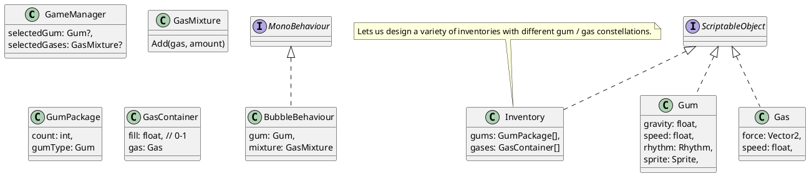

```plantuml
@startuml

class GameManager {
    selectedGum: Gum?,
    selectedGases: GasMixture?
}

class BubbleBehaviour implements MonoBehaviour {
    gum: Gum,
    mixture: GasMixture
}

class GasMixture {
    Add(gas, amount)
}

class Inventory implements ScriptableObject {
    gums: GumPackage[],
    gases: GasContainer[]
}

class GumPackage {
    count: int,
    gumType: Gum
}

class GasContainer {
    fill: float, // 0-1
    gas: Gas
}

class Gum implements ScriptableObject {
    gravity: float,
    speed: float,
    rhythm: Rhythm,
    sprite: Sprite,
}

class Gas implements ScriptableObject {
    force: Vector2,
    speed: float,
}


note top of Inventory: Lets us design a variety of inventories with different gum / gas constellations.


@enduml
```